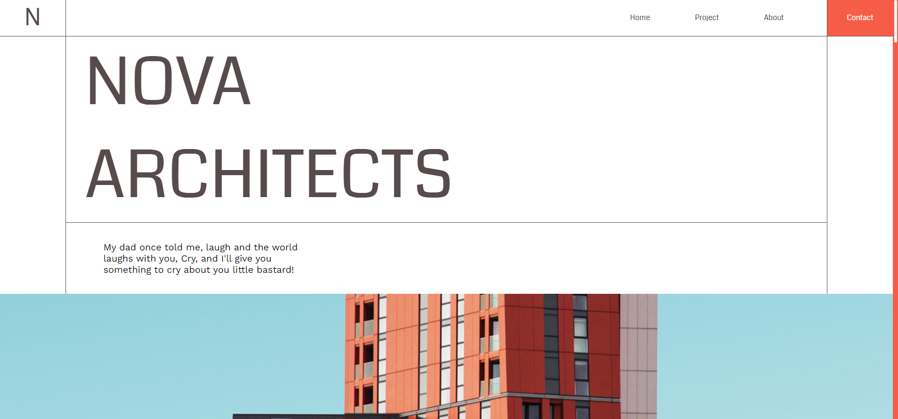

# nova_architects
Верстка лэндинга NOVA Architects

___





____

### Верска выполнена с использование следующих технологий:

* Gulp
* SCSS
* SlickSliders
* FontAwesome 5
___

### Дополнительно

* Реализованы эффекты на странице
* Добавлен адаптив страницы
* Добавлено адаптивное меню под мобильные устройства


[Макет лэндинга](https://www.figma.com/file/L2f6Ex8oLNYwqS5R7IY9C2/Nova?node-id=0%3A1)

[Готовый вариант](https://nova-architects.netlify.app/)

___

``` gulp serve ```  -  запустить проект для разработки

``` gulp build ```  -  запустить проект для сборки

``` gulp clear ```  -  очистить папку сборки
